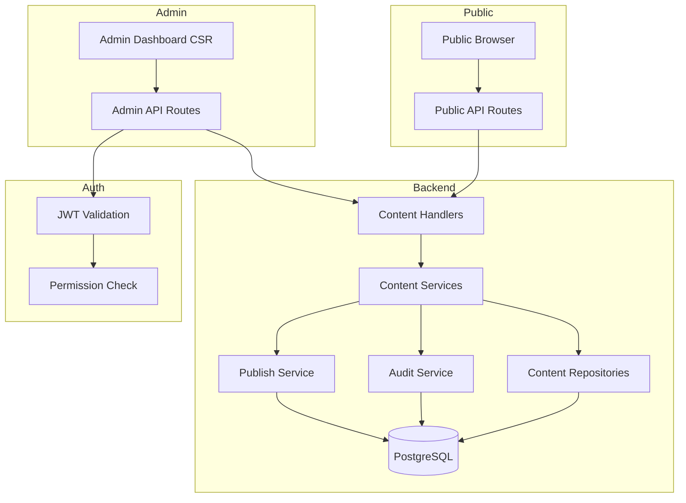
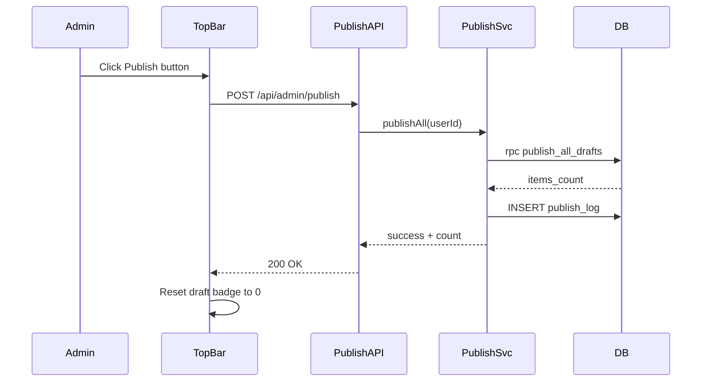
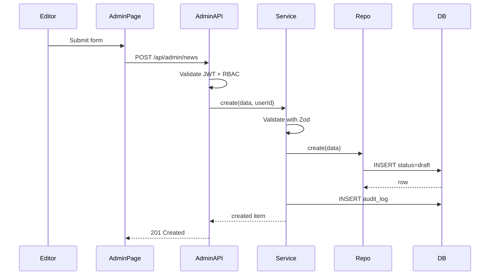

# Design Document

## Overview

**Purpose**: This feature delivers a complete CMS backend and admin dashboard for the Golden Sungava school website, replacing 16 mock data endpoints with real database-backed content management.

**Users**: School staff (admin/editor) manage content via a mobile-first admin dashboard. Public visitors consume published content via ISR pages. Developers flip `implemented: true` per endpoint to switch from mocks to real API.

**Impact**: Transforms the static mock-driven frontend into a fully dynamic CMS-powered website with draft/publish workflow, bilingual content management, and role-based access control.

### Goals
- Database schema for all 16 content types with bilingual JSONB columns
- Draft/publish workflow with single Publish button
- Public API endpoints replacing all mock data
- Mobile-first admin dashboard with CRUD for all content types
- RBAC (admin/editor/viewer) enforced at API and UI level

### Non-Goals
- Real-time collaborative editing (future)
- Content versioning/history (beyond audit log)
- Image upload to Supabase Storage (uses Google Drive URLs)
- Push notifications
- Admission form processing backend

## Architecture

### Existing Architecture Analysis
- **Frontend**: 16 ISR pages consuming `fetchApi()` → mock data via `apiRegistry`
- **Backend skeleton**: BaseRepository (CRUD + soft delete + pagination), pagination utilities, Supabase admin client
- **Auth**: AuthProvider (client), RequireAuth guard, server-auth JWT validation, Supabase middleware for `/admin/*` protection
- **RBAC**: 3 roles (admin/editor/viewer), 2 resources (files/settings) — needs expansion to 8 resources
- **Layout**: Single root layout with Header/Footer — needs route group split

### Architecture Pattern & Boundary Map



**Architecture Integration**:
- Selected pattern: Handler → Service → Repository (existing, extended)
- Domain boundaries: Generic content CRUD for 12 types; custom handlers for gallery, site-config, navigation, staff
- Existing patterns preserved: BaseRepository, pagination utils, auth guards, fetchApi client
- New components: PublishService, AuditService, admin UI shell, bilingual inputs
- Steering compliance: No RLS, soft delete, JSONB bilingual columns, arrow functions only

### Technology Stack

| Layer | Choice / Version | Role | Notes |
|-------|------------------|------|-------|
| Frontend | Next.js 16.1, React 19, shadcn/ui | Admin dashboard CSR pages | Install shadcn components: button, input, textarea, dialog, tabs, table, badge, sheet, toast |
| Backend | Next.js API Routes, Zod 4 | Handler → Service → Repository | Generic content handler for 12 types, custom for 4 |
| Data | PostgreSQL 17 via Supabase | All content storage | JSONB bilingual columns, `content_status` enum |
| Auth | Supabase Auth, app-layer RBAC | JWT + permission checks | Expand resources from 2 to 8 |
| Forms | React Hook Form 7 + Zod 4 | Admin CRUD forms | Bilingual tabbed inputs |

## System Flows

### Publish Flow



### Content CRUD Flow



## Requirements Traceability

| Req | Summary | Components | Interfaces | Flows |
|-----|---------|------------|------------|-------|
| 1.1-1.6 | DB schema + bilingual JSONB | Schema files, BaseRepository extension | — | — |
| 2.1-2.6 | Draft/publish workflow | PublishService, PublishButton, publish_all_drafts RPC | POST /api/admin/publish | Publish Flow |
| 3.1-3.6 | Public API endpoints | PublicContentHandler, ContentRepository | GET /api/[endpoint] | — |
| 4.1-4.8 | Admin API endpoints | AdminContentHandler, auth middleware | CRUD /api/admin/[resource] | Content CRUD Flow |
| 5.1-5.7 | Backend service layer | ContentService, AuditService, PublishService | Service interfaces | — |
| 6.1-6.6 | Auth & login | LoginPage, AuthProvider, profiles table | — | — |
| 7.1-7.6 | RBAC | PermissionsModule (expanded) | hasPermission, requirePermission | — |
| 8.1-8.6 | Admin layout (mobile-first) | AdminLayout, AdminSidebar, AdminTopbar | — | — |
| 9.1-9.8 | Content CRUD pages | ContentListPage, ContentFormDialog, SingletonEditor | — | Content CRUD Flow |
| 10.1-10.5 | Bilingual inputs | BilingualInput, BilingualTextarea, BilingualRichText | React Hook Form integration | — |
| 11.1-11.5 | Route group refactoring | PublicLayout, AdminLayout, RootLayout | — | — |
| 12.1-12.4 | Audit logging | AuditService, AuditLogViewer | — | — |
| 13.1-13.5 | Seed data | init.sql, publish_all_drafts function | — | — |

## Components and Interfaces

| Component | Layer | Intent | Req | Key Dependencies | Contracts |
|-----------|-------|--------|-----|------------------|-----------|
| Schema files | Data | Define all 22 tables | 1.1-1.6 | PostgreSQL 17 | — |
| ContentRepository | Data | Generic CRUD for bilingual content | 5.1-5.2 | BaseRepository (P0) | Service |
| ContentService | Backend | Validate + audit + delegate to repo | 5.3-5.4 | ContentRepository (P0), AuditService (P1) | Service |
| PublicContentHandler | Backend | Serve published content for public API | 3.1-3.6 | ContentService (P0) | API |
| AdminContentHandler | Backend | Authenticated CRUD for admin API | 4.1-4.8 | ContentService (P0), RBAC (P0) | API |
| PublishService | Backend | Atomic publish-all transaction | 2.1-2.6, 5.6 | Supabase RPC (P0) | Service |
| AuditService | Backend | Append-only change logging | 12.1-12.4, 5.4 | DB (P0) | Service |
| PermissionsModule | Backend | Expanded RBAC (8 resources) | 7.1-7.6 | — | Service |
| AdminLayout | UI | Shell with topbar + sidebar + auth | 8.1-8.6 | RequireAuth (P0) | State |
| ContentListPage | UI | Generic data table for list content | 9.1-9.2 | AdminAPI (P0) | — |
| ContentFormDialog | UI | Generic create/edit form | 9.3-9.5 | BilingualInput (P0), Zod (P0) | — |
| BilingualInput | UI | Tabbed EN/NP input for React Hook Form | 10.1-10.5 | React Hook Form (P0) | — |
| PublishButton | UI | Navbar button with draft count badge | 2.2-2.3 | PublishService (P0) | — |
| LoginPage | UI | Email/password login | 6.1-6.5 | Supabase Auth (P0) | — |

### Data Layer

#### Schema Files

| Field | Detail |
|-------|--------|
| Intent | Define all 22 PostgreSQL tables with bilingual JSONB columns, enums, and constraints |
| Requirements | 1.1, 1.2, 1.3, 1.4, 1.5, 1.6 |

**Responsibilities & Constraints**
- Source of truth: `supabase/schema/*.sql`
- Enums: `content_status` (draft, published), `user_role` (admin, editor, viewer)
- All content tables share: id (UUID), created_at, updated_at, deleted_at, is_active, status, sort_order
- JSONB bilingual fields: `{"en": "...", "np": "..."}`

**Contracts**: Service [ ] / API [ ] / Event [ ] / Batch [ ] / State [ ]

**Implementation Notes**
- 4 schema files: `001_profiles.sql`, `002_content_tables.sql`, `003_gallery.sql`, `004_system_tables.sql`
- Include `publish_all_drafts(p_user_id UUID)` PostgreSQL function in `004_system_tables.sql`
- Seed file `supabase/seed/init.sql` inserts all mock data with `status='published'`

#### ContentRepository

| Field | Detail |
|-------|--------|
| Intent | Extend BaseRepository with JSONB language extraction and published-content filtering |
| Requirements | 5.1, 5.2 |

**Dependencies**
- Inbound: ContentService — CRUD operations (P0)
- External: BaseRepository — extends (P0)

**Contracts**: Service [x]

##### Service Interface
```typescript
interface ContentRepository<TInsert, TSelect> extends BaseRepository<TInsert, TSelect> {
  findPublished(lang: 'en' | 'np', options?: PaginationOptions): Promise<PaginatedResult<TSelect>>;
  findDrafts(options?: PaginationOptions): Promise<PaginatedResult<TSelect>>;
  countDrafts(): Promise<number>;
}
```
- Preconditions: Table exists with `status`, `deleted_at`, `is_active`, and JSONB bilingual columns
- Postconditions: `findPublished` returns only published, active, non-deleted rows with flat string fields (language extracted)

**Implementation Notes**
- **Phase 1 spike**: Validate Supabase JS `select('field->>en')` syntax against a real table before building all 16 endpoints. If aliasing fails, fall back to: (a) PostgreSQL views per table that pre-extract languages, or (b) fetch full JSONB and extract in service layer.
- `findPublished(lang)` builds dynamic `select()` string using Supabase `->>lang` syntax for each bilingual column
- Each concrete repository defines its `bilingualColumns: string[]` array so the base method knows which fields to extract
- Non-bilingual tables (staff) skip language extraction

### Backend Layer

#### ContentService

| Field | Detail |
|-------|--------|
| Intent | Validate input with Zod, delegate to repository, log to audit |
| Requirements | 5.3, 5.4 |

**Dependencies**
- Inbound: AdminContentHandler — CRUD requests (P0)
- Outbound: ContentRepository — data access (P0)
- Outbound: AuditService — change logging (P1)

**Contracts**: Service [x]

##### Service Interface
```typescript
interface ContentService<TCreate, TUpdate, TSelect> {
  list(options: PaginationOptions, filters?: FilterOptions): Promise<PaginatedResult<TSelect>>;
  listPublished(lang: 'en' | 'np', options?: PaginationOptions): Promise<PaginatedResult<TSelect>>;
  getById(id: string): Promise<TSelect | null>;
  create(data: TCreate, userId: string): Promise<TSelect>;
  update(id: string, data: TUpdate, userId: string): Promise<TSelect | null>;
  remove(id: string, userId: string): Promise<boolean>;
}
```

#### PublishService

| Field | Detail |
|-------|--------|
| Intent | Atomic publish-all transaction via PostgreSQL RPC |
| Requirements | 2.1, 2.2, 2.5, 2.6, 5.6 |

**Dependencies**
- External: Supabase RPC `publish_all_drafts` function (P0)

**Contracts**: Service [x]

##### Service Interface
```typescript
interface PublishService {
  publishAll(userId: string): Promise<{ itemsPublished: number }>;
  getDraftCount(): Promise<number>; // calls get_draft_count() PostgreSQL function (single query, not 16 round trips)
}
```
- Preconditions: User has admin role
- Postconditions: All draft rows across all content tables set to published; publish_log entry created
- Invariants: Transaction rolls back entirely on failure

#### AuditService

| Field | Detail |
|-------|--------|
| Intent | Append-only logging of all content changes |
| Requirements | 12.1, 12.2, 12.4 |

**Contracts**: Service [x]

##### Service Interface
```typescript
interface AuditService {
  log(entry: {
    userId: string;
    action: 'create' | 'update' | 'delete' | 'publish';
    resource: string;
    resourceId: string;
    details: Record<string, unknown>;
  }): Promise<void>;
}
```

#### PermissionsModule (Expanded)

| Field | Detail |
|-------|--------|
| Intent | Expand RBAC from 2 resources to 8 for full CMS coverage |
| Requirements | 7.1, 7.2, 7.3, 7.4, 7.5 |

**Contracts**: Service [x]

##### Service Interface
```typescript
type CmsResource = 'content' | 'gallery' | 'staff' | 'site-config' | 'navigation' | 'users' | 'publish' | 'audit-log';
type CmsAction = 'read' | 'create' | 'update' | 'delete' | 'manage';

// Same hasPermission/requirePermission signatures, expanded matrix:
// admin: full CRUD + manage on all resources
// editor: CRUD on content/gallery/staff; read on others
// viewer: read on all
```

### API Layer

#### Public API Routes

| Field | Detail |
|-------|--------|
| Intent | Serve published content for public website consumption |
| Requirements | 3.1, 3.2, 3.3, 3.4, 3.5, 3.6 |

**Contracts**: API [x]

##### API Contract

| Method | Endpoint | Request | Response | Errors |
|--------|----------|---------|----------|--------|
| GET | /api/site-config | `?lang=en` | `ApiResponse<SiteConfig>` | 500 |
| GET | /api/hero-slides | `?lang=en` | `ApiResponse<HeroSlide[]>` | 500 |
| GET | /api/news | `?lang=en&page=1&limit=10&search=...` | `PaginatedResponse<NewsArticle[]>` | 500 |
| GET | /api/gallery/events | `?lang=en` | `ApiResponse<GalleryEvent[]>` | 500 |
| GET | /api/principal-message | `?lang=en` | `ApiResponse<PrincipalMessage>` | 500 |
| ... | ... (all 16 endpoints) | `?lang={en\|np}` | Typed response | 500 |

#### Admin API Routes

| Field | Detail |
|-------|--------|
| Intent | Authenticated CRUD endpoints for admin dashboard |
| Requirements | 4.1, 4.2, 4.3, 4.4, 4.5, 4.6, 4.7, 4.8 |

**Contracts**: API [x]

##### API Contract

| Method | Endpoint | Request | Response | Errors |
|--------|----------|---------|----------|--------|
| GET | /api/admin/news | `?page=1&limit=10&includeDeleted=false` | `PaginatedResponse<News[]>` | 401, 403, 500 |
| POST | /api/admin/news | `CreateNewsRequest` body | `News` | 400, 401, 403, 500 |
| PATCH | /api/admin/news/[id] | `UpdateNewsRequest` body | `News` | 400, 401, 403, 404, 500 |
| DELETE | /api/admin/news/[id] | — | `{ success: true }` | 401, 403, 404, 500 |
| POST | /api/admin/publish | — | `{ itemsPublished: number }` | 401, 403, 500 |
| GET | /api/admin/publish/count | — | `{ count: number }` | 401, 403, 500 |

All admin endpoints require `Authorization: Bearer <jwt>` header.

### UI Layer

#### AdminLayout

| Field | Detail |
|-------|--------|
| Intent | Admin shell with responsive topbar, sidebar, and auth guard |
| Requirements | 8.1, 8.2, 8.3, 8.4, 8.5, 8.6 |

**Contracts**: State [x]

##### State Management
- Draft count: fetched on mount from `/api/admin/publish/count`, refreshed after CRUD operations
- Sidebar open/closed: local state, persisted to localStorage
- Mobile: sidebar hidden by default, opens as sheet overlay

**Implementation Notes**
- Desktop (md+): fixed sidebar (240px) + topbar + content area
- Mobile: topbar only + sheet sidebar (triggered by hamburger) OR bottom nav for key sections
- Topbar: logo, Publish button (with badge), user avatar dropdown (profile, logout)
- Uses shadcn/ui Sheet for mobile sidebar, DropdownMenu for user menu

#### ContentListPage (Generic)

| Field | Detail |
|-------|--------|
| Intent | Reusable data table page for all 14 list content types |
| Requirements | 9.1, 9.2, 9.6 |

**Implementation Notes**
- Parameterized by: resource name, column definitions, API endpoint
- Features: paginated table, search input, sort by column headers, status badges, action buttons (edit/delete)
- Delete triggers confirmation dialog then soft delete via API
- Uses shadcn/ui Table, Badge, Button, Input, Dialog

#### ContentFormDialog

| Field | Detail |
|-------|--------|
| Intent | Generic create/edit form dialog for content types |
| Requirements | 9.3, 9.4, 9.5 |

**Implementation Notes**
- Parameterized by: Zod schema, field config array, initial values (for edit)
- Renders fields dynamically based on config: bilingual-input, bilingual-textarea, bilingual-rich-text, image-url-input, select, date picker
- Submit validates with Zod, calls admin API, refreshes list on success
- Uses shadcn/ui Dialog, Form components

#### BilingualInput

| Field | Detail |
|-------|--------|
| Intent | Tabbed EN/NP text input integrated with React Hook Form |
| Requirements | 10.1, 10.4, 10.5 |

**Implementation Notes**
- Wraps shadcn/ui Tabs with two tab panels (EN, NP)
- Each tab contains an Input (or Textarea/RichText variant) bound to `fieldName.en` and `fieldName.np`
- Shows warning indicator when one language tab is empty
- Stores as `{"en": "...", "np": "..."}` matching JSONB column shape

#### PublishButton

| Field | Detail |
|-------|--------|
| Intent | Topbar button with draft count badge |
| Requirements | 2.2, 2.3 |

**Implementation Notes**
- Displays draft count as numeric badge (e.g., "Publish (5)")
- Disabled when count is 0
- Click triggers confirmation dialog, then POST to `/api/admin/publish`
- On success: resets badge, shows toast notification
- On error: shows error toast, badge unchanged

#### LoginPage

| Field | Detail |
|-------|--------|
| Intent | Email/password login for admin access |
| Requirements | 6.1, 6.2, 6.3, 6.5 |

**Implementation Notes**
- Minimal layout (no Header/Footer, no sidebar)
- School logo + "Admin Login" heading
- Email + password fields with Zod validation
- Calls `supabase.auth.signInWithPassword()`
- Success: redirect to `/admin`; Error: generic message

## Data Models

### Domain Model

**Aggregates**:
- **Content Aggregate**: Any content type (news, events, blogs, etc.) with bilingual fields, status lifecycle (draft → published), soft delete, and ordering
- **Gallery Aggregate**: GalleryEvent as root, GalleryPhoto and GalleryVideo as children
- **Singleton Aggregate**: SiteConfig, PrincipalMessage — single-row upsert pattern
- **User Aggregate**: Profile linked to Supabase Auth user, role assignment

**Business Rules**:
- New content starts as `draft`; edits to published content stay `published` (no re-drafting)
- Only `admin` role can trigger publish
- Soft-deleted content excluded from public API
- `is_active = false` content excluded from public API but visible in admin
- Audit log is append-only (Category 1 — never delete)

### Physical Data Model

**Enum Types**:
```sql
CREATE TYPE content_status AS ENUM ('draft', 'published');
CREATE TYPE user_role AS ENUM ('admin', 'editor', 'viewer');
```

**Common Column Pattern** (all content tables):
```sql
id UUID DEFAULT gen_random_uuid() PRIMARY KEY,
status content_status DEFAULT 'draft',
is_active BOOLEAN DEFAULT true,
sort_order INTEGER DEFAULT 0,
created_at TIMESTAMPTZ DEFAULT now(),
updated_at TIMESTAMPTZ DEFAULT now(),
deleted_at TIMESTAMPTZ
```

**Key Tables** (representative examples):

```sql
-- News (representative of 12 similar list tables)
CREATE TABLE news (
  id UUID DEFAULT gen_random_uuid() PRIMARY KEY,
  title JSONB NOT NULL,          -- {"en": "...", "np": "..."}
  date DATE NOT NULL,
  excerpt JSONB,
  image_url TEXT,
  category TEXT,
  content JSONB,
  status content_status DEFAULT 'draft',
  is_active BOOLEAN DEFAULT true,
  sort_order INTEGER DEFAULT 0,
  created_at TIMESTAMPTZ DEFAULT now(),
  updated_at TIMESTAMPTZ DEFAULT now(),
  deleted_at TIMESTAMPTZ
);

-- Gallery (parent-child)
CREATE TABLE gallery_events (
  -- common columns + name JSONB, date DATE, cover_url TEXT
);
CREATE TABLE gallery_photos (
  id UUID DEFAULT gen_random_uuid() PRIMARY KEY,
  gallery_event_id UUID REFERENCES gallery_events(id) ON DELETE CASCADE,
  url TEXT NOT NULL,
  caption JSONB,
  sort_order INTEGER DEFAULT 0,
  created_at TIMESTAMPTZ DEFAULT now(),
  updated_at TIMESTAMPTZ DEFAULT now()
);

-- Profiles (system)
CREATE TABLE profiles (
  id UUID DEFAULT gen_random_uuid() PRIMARY KEY,
  user_id UUID REFERENCES auth.users(id) ON DELETE CASCADE UNIQUE,
  role user_role DEFAULT 'viewer',
  display_name TEXT,
  avatar_url TEXT,
  created_at TIMESTAMPTZ DEFAULT now(),
  updated_at TIMESTAMPTZ DEFAULT now()
);

-- Audit Log (append-only)
CREATE TABLE audit_log (
  id UUID DEFAULT gen_random_uuid() PRIMARY KEY,
  user_id UUID REFERENCES auth.users(id),
  action TEXT NOT NULL,
  resource TEXT NOT NULL,
  resource_id UUID,
  details JSONB,
  created_at TIMESTAMPTZ DEFAULT now()
);
```

**PostgreSQL Functions**:
```sql
-- Atomic publish: flip all drafts to published in one transaction
CREATE OR REPLACE FUNCTION publish_all_drafts(p_user_id UUID)
RETURNS INTEGER AS $$
DECLARE
  total_count INTEGER := 0;
  row_count INTEGER;
BEGIN
  UPDATE news SET status = 'published', updated_at = now() WHERE status = 'draft' AND deleted_at IS NULL;
  GET DIAGNOSTICS row_count = ROW_COUNT; total_count := total_count + row_count;
  -- ... repeat for all content tables ...

  INSERT INTO publish_log (user_id, published_at, items_count)
  VALUES (p_user_id, now(), total_count);

  RETURN total_count;
END;
$$ LANGUAGE plpgsql;

-- Single-query draft count across all tables (avoids 16 round trips)
CREATE OR REPLACE FUNCTION get_draft_count()
RETURNS INTEGER AS $$
  SELECT COALESCE(SUM(cnt), 0)::INTEGER FROM (
    SELECT COUNT(*) AS cnt FROM news WHERE status = 'draft' AND deleted_at IS NULL
    UNION ALL
    SELECT COUNT(*) FROM events WHERE status = 'draft' AND deleted_at IS NULL
    UNION ALL
    SELECT COUNT(*) FROM blogs WHERE status = 'draft' AND deleted_at IS NULL
    -- ... repeat for all content tables with status column ...
  ) counts;
$$ LANGUAGE sql STABLE;
```

## Error Handling

### Error Strategy
- **Validation errors (400)**: Zod parse errors returned as field-level messages
- **Auth errors (401)**: Generic "Authentication required" — no detail leakage
- **Permission errors (403)**: "Insufficient permissions for this action"
- **Not found (404)**: "Resource not found"
- **Server errors (500)**: Logged with details, generic message to client
- **Publish failure (500)**: Transaction auto-rollback, error toast in UI

### Monitoring
- All errors logged via `console.error` with structured context (userId, resource, action)
- Audit log captures all admin mutations for accountability

## Testing Strategy

### Unit Tests
- ContentRepository: `findPublished(lang)` returns correct language, filters status/deleted/active
- ContentService: Zod validation rejects invalid input, audit log called on mutations
- PublishService: `getDraftCount()` aggregates correctly across tables
- PermissionsModule: Each role/resource/action combination returns expected result
- BilingualInput: Stores correct JSONB shape, warns on empty language

### Integration Tests
- Public API: GET returns only published content, respects lang param, pagination works
- Admin API: POST creates draft, PATCH updates, DELETE soft-deletes, auth enforced
- Publish flow: POST /api/admin/publish flips all drafts, returns count, logs action
- Route groups: Public pages render with Header/Footer, admin pages render with sidebar

### E2E Tests (Playwright)
- Login → redirect to admin dashboard
- Create news article (bilingual) → appears in admin list as draft
- Publish → article appears on public news page
- Mobile: admin sidebar opens/closes correctly
- Permission: editor cannot see Publish button

## Security Considerations

- JWT validation on every admin API request via `getUserFromToken()`
- RBAC check via `requirePermission()` before every mutation
- No RLS — all access control at application layer (per CLAUDE.md)
- Audit log records all mutations with user attribution
- Login page does not reveal whether email exists (generic error)
- Service role key used only server-side, never exposed to client

## Migration Strategy

**Phase 1**: Schema + seed + JSONB syntax spike (no frontend changes, mocks still active)
**Phase 2**: Backend layer (repos, services, handlers) + public API routes
**Phase 3**: Flip `implemented: true` per endpoint — frontend auto-switches from mocks to real API
**Phase 4**: Route group refactoring + admin layout + login page
**Phase 5**: Admin CRUD pages + publish button
**Phase 6**: Permissions expansion + audit log viewer

Each phase is independently deployable. Phase 3 is the switchover point — public site starts serving real data.
