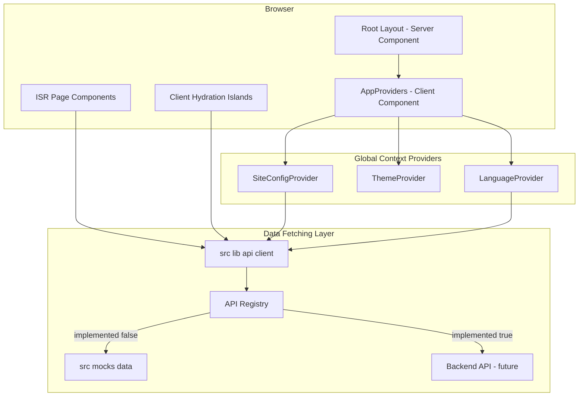
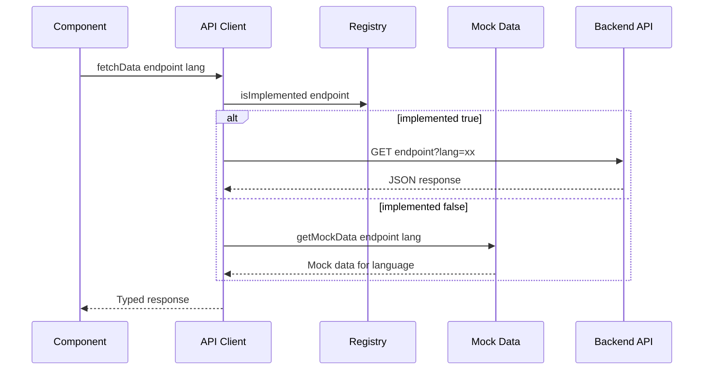
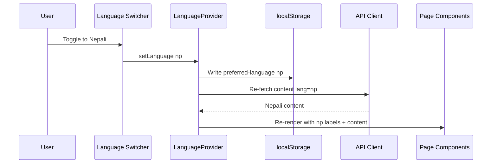
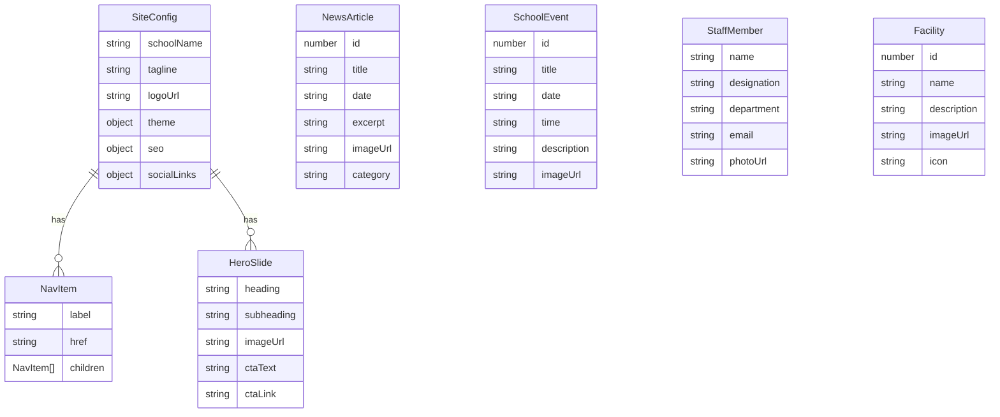

# Technical Design: CMS-Driven Homepage Frontend

## Overview

**Purpose**: This feature delivers a premium, CMS-driven public website for Golden Sungava English Boarding School — serving as the school's digital identity for parents, students, and prospective families.

**Users**: Parents (primary), prospective families, students, and school administrators browse bilingual content across 17+ public pages. All text, images, colors, and SEO metadata are sourced from a CMS data layer via a mock-first API abstraction.

**Impact**: Transforms the codebase from empty scaffolding into a complete ISR-rendered, PWA-enabled, SEO-optimized school website with feature-flag-controlled mock APIs.

### Goals
- Deliver all 17 public pages with CMS-driven content
- ISR for < 2.5s LCP on mobile 3G
- Full bilingual support (en/np) with client-side language switching
- Mock-first API layer with per-endpoint implementation tracking
- PWA installable as mobile app
- SEO optimized for Google + AI search

### Non-Goals
- Admin CMS dashboard UI (separate spec)
- Backend API implementation (mocked for now)
- Payment gateway integration (info pages only)
- Push notifications (future enhancement)
- User authentication for public pages

---

## Architecture

### Architecture Pattern & Boundary Map



**Architecture Integration**:
- **Selected pattern**: Server Components + Client Islands with Provider-based state. ISR pages render as Server Components; interactive sections (carousel, language toggle, forms) hydrate as Client Components.
- **Domain boundaries**: Data fetching isolated in `src/lib/api/`, UI in `src/components/public/`, state in `src/frontend/providers/`, mock data in `src/mocks/`
- **Existing patterns preserved**: Three-layer backend (Handler → Service → Repository), BaseRepository, app-layer RBAC, proxy.ts
- **New components rationale**: API client abstracts mock/real switching; SiteConfigProvider + LanguageProvider enable CMS-driven theming and i18n
- **Steering compliance**: Arrow functions only, named exports, one component per file, DRY, no hardcoded hex

### Technology Stack

| Layer | Choice / Version | Role in Feature | Notes |
|-------|------------------|-----------------|-------|
| Framework | Next.js 16.1 (App Router) | ISR rendering, route-based code splitting | Already installed |
| UI Components | shadcn/ui (Radix) + Tailwind 4 | All page components | MUI removed entirely — shadcn/ui for everything |
| Styling | TailwindCSS 4 + CSS custom properties | Theme tokens, responsive design | Colors from CMS via CSS vars |
| Icons | Lucide React | Consistent iconography | Already installed |
| Forms | React Hook Form + Zod 4 | Admission + contact forms | Already installed |
| Fonts | DM Sans + Cormorant Garamond + Noto Sans Devanagari | Body + heading + Nepali fallback typography | DM Sans/Cormorant lack Devanagari; Noto added as fallback |
| Animations | CSS @keyframes + custom useInView hook | Scroll-triggered animations | Zero dependency |
| PWA | next-pwa or manual service worker | Offline support, install prompt | New dependency |
| Markdown | react-markdown + rehype | Rich text CMS content | Already installed |

---

## System Flows

### Data Fetching Flow (Mock/Real API Switch)



### Language Switch Flow



---

## Requirements Traceability

| Requirement | Summary | Components | Interfaces |
|-------------|---------|------------|------------|
| 1.1-1.5 | CMS site config | SiteConfigProvider, ThemeProvider, Footer | SiteConfig type, useSiteConfig hook |
| 2.1-2.10 | Mock API system | API Client, Registry, Mock Data | fetchData, ApiRegistry |
| 3.1-3.6 | Hero carousel | HeroCarousel, HeroSlide, HeroControls | HeroSlide type |
| 4.1-4.4 | Facilities preview | FacilitiesPreview, FacilityCard | Facility type |
| 5.1-5.3 | Activities section | ActivitiesSection, ActivityCard | Activity type |
| 6.1-6.6 | News & events | LatestNews, UpcomingEvents, NewsCard, EventCard | NewsArticle, SchoolEvent types |
| 7.1-7.3 | Blog preview | BlogPreview, BlogCard | BlogPost type |
| 8.1-8.3 | Testimonials | TestimonialsCarousel, TestimonialCard | Testimonial type |
| 9.1-9.3 | About Us | AboutPage | CMS rich text |
| 10.1-10.2 | Principal's Message | PrincipalMessagePage | PrincipalMessage type |
| 11.1-11.4 | Staff directory | StaffDirectory, StaffCard, DepartmentFilter | StaffMember type |
| 12.1-12.5 | Gallery | PhotoGallery, VideoGallery, Lightbox | PhotoAlbum type |
| 13.1-13.6 | News/Events/Notices pages | ListingPage, DetailPage, SearchFilter | Pagination types |
| 14.1-14.5 | Admission | AdmissionPage, AdmissionForm | Zod schema |
| 15.1-15.4 | Calendar/Facilities/Downloads | CalendarPage, FacilitiesPage, DownloadsPage | Various |
| 16.1-16.5 | Payment/Contact | PaymentInfoPage, ContactPage, ContactForm | ContactFormSchema |
| 17.1-17.6 | Navigation & layout | Header, MobileDrawer, Footer, FloatingCTA, LanguageSwitcher | NavItem type |
| 18.1-18.6 | ISR & performance | ISR config, Image optimization, Skeletons | revalidateTag |
| 19.1-19.5 | PWA | manifest.json, service worker, OfflinePage, InstallPrompt | PWA config |
| 20.1-20.11 | SEO | SEOHead, JsonLd, Sitemap, Breadcrumbs | SEO metadata types |
| 21.1-21.10 | i18n | LanguageProvider, translations, language-aware fetching | useLanguage hook |
| 22.1-22.5 | Global context | AppProviders, SiteConfigProvider, ThemeProvider, LanguageProvider | Provider hooks |
| 23.1-23.6 | Component architecture | File structure, barrel exports | Project conventions |
| 24.1-24.7 | Design system | globals.css tokens, typography, animations | CSS custom properties |
| 25.1-25.8 | Mock data | Mock files, registry, bilingual data | Mock types |

---

## Components and Interfaces

| Component | Domain | Intent | Req Coverage | Key Dependencies | Contracts |
|-----------|--------|--------|--------------|------------------|-----------|
| API Client | Data Layer | Centralized data fetching with mock/real switch | 2.1-2.10 | Registry, MockData (P0) | Service |
| ApiRegistry | Data Layer | Per-endpoint implementation status tracking | 2.6-2.9 | None | State |
| SiteConfigProvider | Context | CMS site configuration context | 1.1-1.5, 22.1 | API Client (P0) | State |
| ThemeProvider | Context | CMS-driven theme tokens as CSS vars | 1.2, 22.2, 24.1-24.3 | SiteConfigProvider (P0) | State |
| LanguageProvider | Context | Bilingual language management | 21.1-21.10, 22.3 | localStorage (P0), API Client (P0) | State |
| AppProviders | Context | Compose all providers | 22.4-22.5 | All providers (P0) | — |
| Header | Layout | Responsive nav with mega-menu | 17.1-17.3, 17.6 | NavItem data, LanguageProvider (P0) | — |
| Footer | Layout | CMS-driven footer | 17.4, 1.5 | SiteConfigProvider (P0) | — |
| MobileDrawer | Layout | Hamburger slide-out nav | 17.2 | Header (P1) | — |
| FloatingCTA | Layout | Persistent admission button on mobile | 17.5 | SiteConfigProvider (P1) | — |
| LanguageSwitcher | Layout | EN/NP toggle in nav | 21.4, 17.6 | LanguageProvider (P0) | — |
| HeroCarousel | Homepage | Full-width hero with auto-advance | 3.1-3.6 | HeroSlide data (P0) | — |
| FacilitiesPreview | Homepage | Facility cards grid/carousel | 4.1-4.4 | Facility data (P0) | — |
| ActivitiesSection | Homepage | Activities carousel | 5.1-5.3 | Activity data (P0) | — |
| LatestNews | Homepage | News cards preview | 6.1, 6.3, 6.5-6.6 | NewsArticle data (P0) | — |
| UpcomingEvents | Homepage | Events cards preview | 6.2, 6.4-6.6 | SchoolEvent data (P0) | — |
| BlogPreview | Homepage | Blog cards preview | 7.1-7.3 | BlogPost data (P0) | — |
| TestimonialsCarousel | Homepage | Testimonials rotation | 8.1-8.3 | Testimonial data (P0) | — |
| SEOHead | Shared | Meta tags + Open Graph + canonical | 20.1, 20.9 | SiteConfigProvider (P0) | — |
| JsonLd | Shared | Schema.org structured data | 20.2, 20.6, 20.8 | SiteConfigProvider (P0) | — |
| Breadcrumbs | Shared | Breadcrumb navigation with structured data | 20.6 | — | — |
| ImageWithFallback | Shared | Image component with onError placeholder | 20.10 | — | — |
| SkeletonLoader | Shared | Content skeleton loading states | 18.6 | — | — |

### Data Layer

#### API Client (`src/lib/api/client.ts`)

| Field | Detail |
|-------|--------|
| Intent | Centralized data fetching that routes to mock or real API based on registry |
| Requirements | 2.1-2.10, 21.10 |

**Responsibilities & Constraints**
- Single entry point for all data fetching across the application
- Reads implementation status from ApiRegistry per endpoint
- Appends `lang` query parameter to all requests
- Returns typed responses matching mock data interfaces

**Dependencies**
- Inbound: All page components and providers — data access (P0)
- Outbound: ApiRegistry — implementation status check (P0)
- Outbound: Mock data files — fallback data source (P0)
- External: Backend API — real data source when implemented (P1)

**Contracts**: Service [x]

##### Service Interface
```typescript
type ApiEndpoint =
  | 'site-config'
  | 'hero-slides'
  | 'navigation'
  | 'news'
  | 'events'
  | 'blogs'
  | 'notices'
  | 'staff'
  | 'facilities'
  | 'activities'
  | 'testimonials'
  | 'gallery-photos'
  | 'principal-message';

type FetchOptions = {
  lang?: string;
  page?: number;
  limit?: number;
  search?: string;
  category?: string;
};

type ApiResponse<T> = {
  data: T;
  error: string | null;
  isMock: boolean;
};

// Main fetch function
const fetchApi: <T>(endpoint: ApiEndpoint, options?: FetchOptions) => Promise<ApiResponse<T>>;
```

- Preconditions: Endpoint must exist in registry
- Postconditions: Returns typed data or error; never throws
- Invariants: `lang` defaults to `en` if not provided; falls back to default language if requested language unavailable

#### ApiRegistry (`src/lib/api/registry.ts`)

| Field | Detail |
|-------|--------|
| Intent | Code-level map of endpoint implementation status |
| Requirements | 2.6-2.9 |

**Contracts**: State [x]

##### State Management
```typescript
type EndpointConfig = {
  implemented: boolean;
  apiUrl: string;
  mockKey: string;
  description: string;
};

const apiRegistry: Record<ApiEndpoint, EndpointConfig>;
```

- All endpoints start as `implemented: false`
- When backend API is built, flip to `implemented: true`
- No runtime mutation — compile-time constant

### Context Providers

#### SiteConfigProvider (`src/frontend/providers/site-config-provider.tsx`)

| Field | Detail |
|-------|--------|
| Intent | Fetch and cache CMS site configuration, expose via hook |
| Requirements | 1.1-1.5, 22.1 |

**Contracts**: State [x]

##### State Management
```typescript
type SiteConfigState = {
  config: SiteConfig | null;
  isLoading: boolean;
  error: string | null;
};

// Hook interface
const useSiteConfig: () => {
  config: SiteConfig;
  isLoading: boolean;
};
```

- Fetches site-config on mount
- Falls back to `src/lib/constants/site-defaults.ts` if API fails
- Caches in React state (single fetch per session)

#### LanguageProvider (`src/frontend/providers/language-provider.tsx`)

| Field | Detail |
|-------|--------|
| Intent | Manage language selection, persist preference, provide translation function |
| Requirements | 21.1-21.10, 22.3 |

**Contracts**: State [x]

##### State Management
```typescript
type LanguageState = {
  lang: 'en' | 'np';
  isLoading: boolean;
};

// Hook interface
const useLanguage: () => {
  lang: 'en' | 'np';
  setLanguage: (lang: 'en' | 'np') => void;
  t: (key: string) => string;
  isLoading: boolean;
};
```

- Reads `preferred-language` from localStorage on mount
- Defaults to `en` if not found or invalid
- On language change: updates localStorage, triggers content re-fetch via API client
- `t()` function reads from `src/lib/i18n/translations/{lang}.ts`

#### CmsThemeProvider (replaces MUI ThemeProvider at `src/frontend/providers/theme-provider.tsx`)

| Field | Detail |
|-------|--------|
| Intent | Inject CMS-sourced theme tokens as CSS custom properties on `:root` |
| Requirements | 1.2, 22.2, 24.1-24.3 |

**Implementation Notes**
- MUI removed entirely — this is a lightweight CSS variable injector, no MUI dependency
- Reads theme colors from SiteConfigProvider
- Applies `--cms-primary`, `--cms-primary-light`, `--cms-primary-dark`, etc. to `document.documentElement.style`
- Tailwind `@theme` directive references these variables with fallback defaults
- Supports light/dark mode via `.dark` class toggle
- No Emotion cache needed — delete `emotion-cache.tsx`

### Layout Components

#### Header (`src/components/public/layout/header.tsx`)

| Field | Detail |
|-------|--------|
| Intent | Responsive navigation with mega-menu, language switcher, mobile hamburger |
| Requirements | 17.1-17.3, 17.6 |

**Implementation Notes**
- Server Component shell with Client Component for mobile toggle + language switcher
- Navigation items from CMS via `mockNavigation[lang]`
- Active page highlighting via `usePathname()`
- Sticky header with backdrop blur on scroll

#### Footer (`src/components/public/layout/footer.tsx`)

| Field | Detail |
|-------|--------|
| Intent | CMS-driven footer with links, contact, social icons |
| Requirements | 17.4, 1.5 |

**Implementation Notes**
- Server Component
- Content from SiteConfigProvider (address, phones, emails, social links)
- Quick links from navigation data

### Homepage Components

All homepage components follow the same pattern:
- **Server Component** fetches data via API Client at ISR build time
- **Props**: Typed data from mock/CMS
- **Max ~50-80 lines JSX**, extract sub-components aggressively
- **Arrow functions only**, named exports

#### HeroCarousel (`src/components/public/home/hero-carousel.tsx`)

| Field | Detail |
|-------|--------|
| Intent | Full-width hero with auto-advance, swipe, LCP-optimized first slide |
| Requirements | 3.1-3.6 |

**Implementation Notes**
- Client Component (`'use client'`) for interactivity (auto-advance, swipe, controls)
- First slide image: `priority={true}` for LCP
- Sub-components: `HeroSlide`, `HeroIndicators`, `HeroControls`
- Auto-advance: 5s interval, pause on hover/touch
- Touch swipe via pointer events (no library needed)

### Shared Components

#### ImageWithFallback (`src/components/shared/image-with-fallback.tsx`)

| Field | Detail |
|-------|--------|
| Intent | Next.js Image wrapper with onError fallback to placeholder |
| Requirements | 20.10 |

**Implementation Notes**
- Wraps `next/image` with `onError` handler
- Falls back to `/images/placeholder.svg` on load failure
- Handles Google Drive + S3 private URLs that may return 403
- All components use this instead of raw `next/image`

#### SEOHead (`src/components/shared/seo-head.tsx`)

| Field | Detail |
|-------|--------|
| Intent | Generate meta tags, Open Graph, canonical URL per page |
| Requirements | 20.1, 20.9 |

**Implementation Notes**
- Uses Next.js `generateMetadata()` in page components
- Accepts CMS SEO fields (title, description, image, keywords)
- Generates canonical URL with lang parameter for hreflang alternates

#### JsonLd (`src/components/shared/json-ld.tsx`)

| Field | Detail |
|-------|--------|
| Intent | Inject Schema.org structured data as JSON-LD script |
| Requirements | 20.2, 20.6, 20.8 |

**Implementation Notes**
- Renders `<script type="application/ld+json">` in head
- Supports: EducationalOrganization, BreadcrumbList, FAQPage schemas
- Data sourced from SiteConfig + page-specific CMS content

---

## Data Models

### Domain Model



### Data Contracts

All API responses follow the bilingual pattern:

```typescript
// Bilingual content type — all content endpoints return this shape
type BilingualData<T> = Record<'en' | 'np', T>;

// API response wrapper
type ApiResponse<T> = {
  data: T;
  error: string | null;
  isMock: boolean;
};
```

**Endpoint contracts** — all accept `?lang=en|np`:

| Endpoint | Response Type | Paginated |
|----------|--------------|-----------|
| GET /api/site-config | `SiteConfig` | No |
| GET /api/hero-slides | `HeroSlide[]` | No |
| GET /api/navigation | `NavItem[]` | No |
| GET /api/news | `NewsArticle[]` | Yes |
| GET /api/events | `SchoolEvent[]` | Yes |
| GET /api/blogs | `BlogPost[]` | Yes |
| GET /api/notices | `Notice[]` | Yes |
| GET /api/staff | `StaffMember[]` | No |
| GET /api/facilities | `Facility[]` | No |
| GET /api/activities | `Activity[]` | No |
| GET /api/testimonials | `Testimonial[]` | No |
| GET /api/gallery/photos | `PhotoAlbum[]` | Yes |
| GET /api/principal-message | `PrincipalMessage` | No |

---

## Foundation & Pre-Work (from Gap Analysis)

Before building new components, the following foundation work addresses gaps identified in the codebase:

### 1. Remove MUI Dependencies
- Uninstall: `@mui/material`, `@mui/icons-material`, `@mui/material-nextjs`, `@emotion/react`, `@emotion/styled`, `@emotion/cache`
- Delete: `src/frontend/providers/emotion-cache.tsx`
- Rewrite: `src/frontend/providers/theme-provider.tsx` (CSS var injector, no MUI)
- Rewrite: `src/frontend/providers/index.tsx` (remove EmotionCacheProvider, MuiThemeProvider)
- Rewrite: `src/app/page.tsx` (replace MUI Box/Typography with Tailwind)

### 2. Refactor Existing Code to Arrow Functions
Files using `function` declarations that must be converted:
- `src/app/layout.tsx`
- `src/app/page.tsx`
- `src/frontend/providers/theme-provider.tsx`
- `src/frontend/providers/index.tsx`
- `src/lib/auth/provider.tsx`
- `src/lib/auth/guards.tsx`

### 3. Add Devanagari Font
- Add `Noto_Sans_Devanagari` via `next/font/google` in layout.tsx
- CSS variable: `--font-devanagari`
- Font stack: `var(--font-dm-sans), var(--font-devanagari), sans-serif`

### 4. Update next.config.ts
- Add remote patterns for: `s3.veda-app.com`, `veda-app.s3.ap-south-1.amazonaws.com`, `drive.google.com`
- Update themeColor in layout.tsx viewport from green (#1a4d2e) to Deep Gold (#B8860B)

### 5. Setup TailwindCSS 4 Design System
- Add `@import "tailwindcss"` to globals.css
- Define `:root` color tokens as CSS custom properties
- Add `@theme` directive referencing CSS variables with fallback defaults
- Define typography classes using font CSS variables

### 6. Create Placeholder Image
- Add `/public/images/placeholder.svg` for ImageWithFallback onError

---

## Error Handling

### Error Strategy
- **API failures**: Return cached/fallback data, never show raw errors to users
- **Image load failures**: `ImageWithFallback` component shows placeholder
- **Missing translations**: Fall back to English content with subtle indicator
- **Offline**: Service worker serves cached pages; uncached routes show branded offline page

### Error Categories
- **Network errors**: Graceful degradation to cached ISR pages
- **404 from unmocked APIs**: API Client returns `{ data: null, error: 'not-implemented' }` — component shows skeleton or fallback
- **Invalid language code**: Defaults to `en`
- **Form validation**: Zod schemas with inline field-level errors (admission, contact forms)

---

## Testing Strategy

### Unit Tests
- API Client: mock/real routing logic based on registry
- LanguageProvider: localStorage read/write, language switching
- Translation function: key lookup, fallback behavior
- ImageWithFallback: onError handler triggers fallback

### Integration Tests
- Homepage: renders all sections with mock data
- Language switch: toggles content language across components
- Navigation: renders CMS menu items, highlights active page

### E2E Tests (Playwright)
- Homepage full page load and interaction (carousel, navigation)
- Language switch persists across page navigation
- Admission form validation and submission
- Mobile responsive layout and hamburger menu
- PWA install prompt appears on eligible browsers

---

## Performance & Scalability

### Targets
- **LCP**: < 2.5s on mobile 3G (hero carousel first slide)
- **FCP**: < 1.5s
- **TTI**: < 3.5s
- **CLS**: < 0.1

### Optimization Strategies
- ISR for all public pages (static HTML + on-demand revalidation)
- Priority loading for hero image (first slide only)
- Lazy loading for all below-fold images
- Route-based code splitting (automatic with Next.js App Router)
- YouTube embeds: click-to-play thumbnails (no iframe until interaction)
- Font subsetting (DM Sans + Cormorant Garamond Latin, Noto Sans Devanagari for Nepali)
- Prefetch visible navigation links via `<Link prefetch>`

---

## File Structure

```
src/
├── app/
│   ├── layout.tsx                    # Root layout + AppProviders
│   ├── page.tsx                      # Homepage (ISR)
│   ├── about/page.tsx
│   ├── principal-message/page.tsx
│   ├── staff/page.tsx
│   ├── gallery/
│   │   ├── photos/page.tsx
│   │   └── videos/page.tsx
│   ├── news/
│   │   ├── page.tsx                  # Listing
│   │   └── [id]/page.tsx             # Detail
│   ├── events/
│   │   ├── page.tsx
│   │   └── [id]/page.tsx
│   ├── notices/page.tsx
│   ├── admission/page.tsx
│   ├── activities/page.tsx
│   ├── calendar/page.tsx
│   ├── facilities/page.tsx
│   ├── blogs/
│   │   ├── page.tsx
│   │   └── [id]/page.tsx
│   ├── downloads/page.tsx
│   ├── payment-info/page.tsx
│   ├── contact/page.tsx
│   ├── sitemap.ts                    # Dynamic sitemap
│   ├── robots.ts                     # robots.txt
│   └── manifest.ts                   # PWA manifest
├── components/
│   ├── public/
│   │   ├── layout/
│   │   │   ├── header.tsx
│   │   │   ├── mobile-drawer.tsx
│   │   │   ├── footer.tsx
│   │   │   ├── floating-cta.tsx
│   │   │   ├── language-switcher.tsx
│   │   │   └── index.ts
│   │   ├── home/
│   │   │   ├── hero-carousel.tsx
│   │   │   ├── facilities-preview.tsx
│   │   │   ├── activities-section.tsx
│   │   │   ├── latest-news.tsx
│   │   │   ├── upcoming-events.tsx
│   │   │   ├── blog-preview.tsx
│   │   │   ├── testimonials-carousel.tsx
│   │   │   └── index.ts
│   │   └── pages/
│   │       ├── staff-directory.tsx
│   │       ├── photo-gallery.tsx
│   │       ├── video-gallery.tsx
│   │       ├── admission-form.tsx
│   │       ├── contact-form.tsx
│   │       └── index.ts
│   └── shared/
│       ├── image-with-fallback.tsx
│       ├── seo-head.tsx
│       ├── json-ld.tsx
│       ├── breadcrumbs.tsx
│       ├── skeleton-loader.tsx
│       ├── section-heading.tsx
│       ├── content-card.tsx
│       ├── listing-page.tsx
│       ├── pagination.tsx
│       └── index.ts
├── frontend/
│   └── providers/
│       ├── index.tsx                  # AppProviders (rebuilt — no MUI/Emotion)
│       ├── site-config-provider.tsx   # NEW
│       ├── language-provider.tsx      # NEW
│       └── theme-provider.tsx         # REPLACED (CSS var injector, no MUI)
├── lib/
│   ├── api/
│   │   ├── client.ts                 # fetchApi function
│   │   └── registry.ts               # API implementation registry
│   ├── i18n/
│   │   ├── translations/
│   │   │   ├── en.ts                  # English UI labels
│   │   │   └── np.ts                  # Nepali UI labels
│   │   └── index.ts                   # Translation helper
│   ├── constants/
│   │   ├── site-defaults.ts           # Fallback site config
│   │   └── app.ts                     # Existing
│   └── hooks/
│       ├── use-in-view.ts             # Intersection Observer for animations
│       └── index.ts
├── mocks/
│   ├── data/                          # 13 bilingual mock files (existing)
│   └── index.ts                       # Registry + re-exports (existing)
└── types/
    └── api.ts                         # Shared API response types
```
